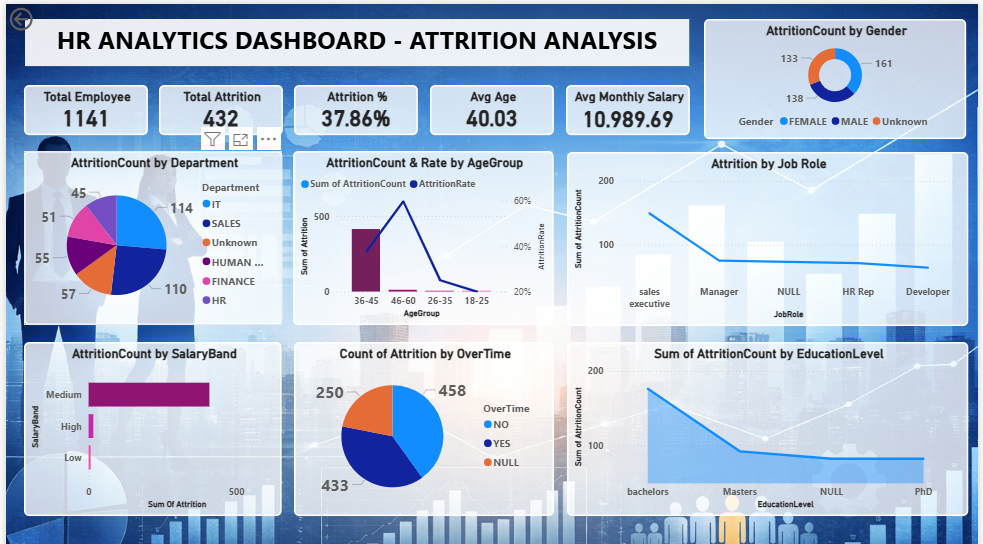

# 📊 HR Analytics Dashboard - Attrition Analysis

## 🎯 Project Overview
This project provides a comprehensive analysis of employee attrition trends within an organization. Using **SQL** for data preparation and **Power BI** for visualization, the dashboard identifies key factors contributing to employee turnover, helping HR leadership make data-driven retention decisions.

## 🚀 Live Dashboard Preview

---

## 🛠️ Tech Stack
* **Data Tool:** MySQL (Data Cleaning & ETL)
* **Visualization:** Power BI
* **Key Skills:** DAX Measures, Data Modeling, Trend Analysis

---

## 📈 Key Insights from the Data
Based on the dashboard analysis:
* **Attrition Rate:** The organization has a high attrition rate of **37.86%**, with 432 employees leaving out of a total of 1,141.
* **Departmental Impact:** The **IT and Sales** departments show the highest count of attrition.
* **Demographics:** Employees in the **36-45 age group** represent a significant portion of the attrition count.
* **Role-Specific Trends:** **Sales Executives** are the most likely to leave, followed by Managers.
* **Overtime Factor:** There is a clear correlation between employees working **Overtime** and higher attrition counts.

---

## 🗄️ SQL Implementation
I used SQL to transform the raw data before importing it into Power BI. Key operations included:
* Categorizing employees into **Salary Bands** (Low, Medium, High).
* Creating **Age Groups** for better demographic segmenting.
* Handling **NULL** values in Job Roles and Education levels to ensure dashboard accuracy.

### Sample formula: Calculating Attrition Rate
'''PowerBI
AttritionRate = sum(Table1[AttritionCount])/COUNT(Table1[EmployeeId])
